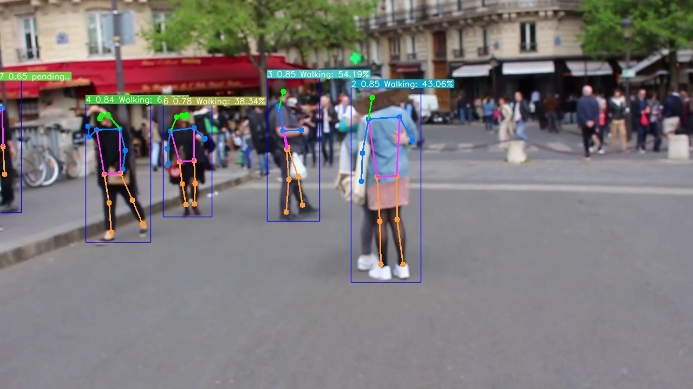

# ActionDetectionInPy
Action Detect Using yolo+bytetrack+stgcn

由Yolo和ByteTrack及STGCN组合而成的行为检测。可以扩展成手势检测等其它商业应用场景。

# Basic Algorithm 基础算法
1. [yolov5](https://github.com/ultralytics/yolov5) / [yolov8](https://github.com/ultralytics/ultralytics.git)
2. [BYTETracker](https://github.com/FoundationVision/ByteTrack)
3. [STGCN](https://github.com/hazdzz/STGCN)

# depend 依赖
```sh
pip3 install cython_bbox
pip3 install lap
pip3 install numpy
pip3 install opencv-python
pip3 install seaborn
pip3 install torch
```

# Version 版本问题
torch 2.6以上修改了加载模型时的`weights_only`参数默认值
```sh
_pickle.UnpicklingError: Weights only load failed. This file can still be loaded, to do so you have two options, do those steps only if you trust the source of the checkpoint. 
	(1) In PyTorch 2.6, we changed the default value of the `weights_only` argument in `torch.load` from `False` to `True`. Re-running `torch.load` with `weights_only` set to `False` will likely succeed, but it can result in arbitrary code execution. Do it only if you got the file from a trusted source.
	(2) Alternatively, to load with `weights_only=True` please check the recommended steps in the following error message.
```

# Usage 使用
```sh
python3 Inference.py
```

# Result 结果
<video src="result.mp4" width="100%" controls></video>

